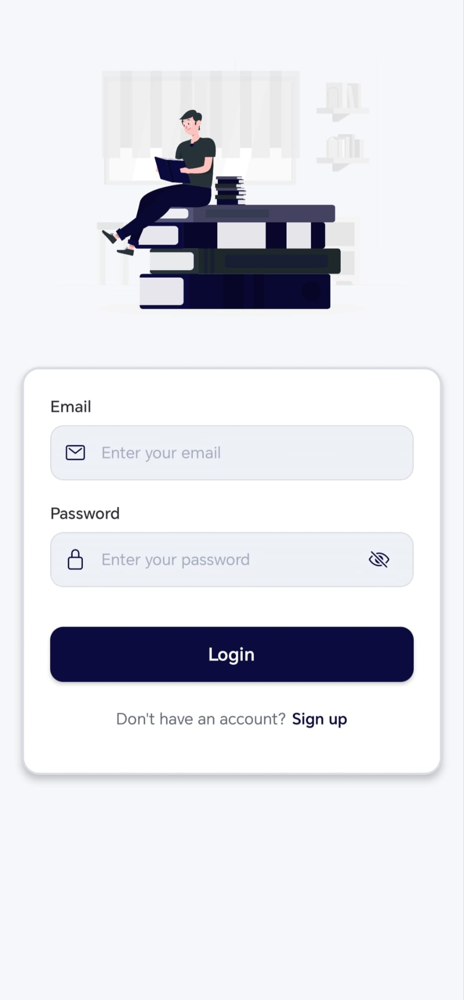
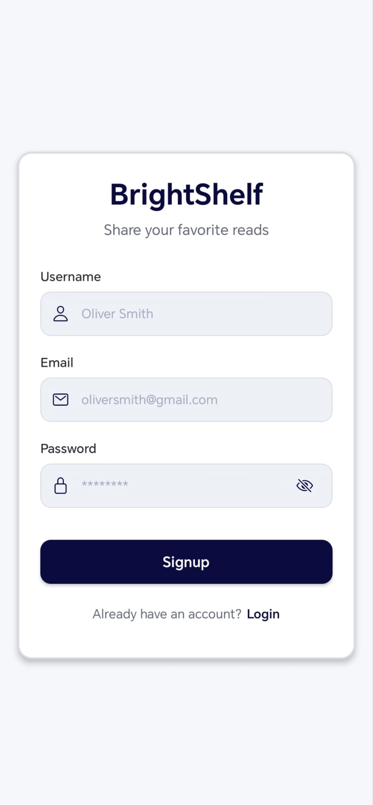
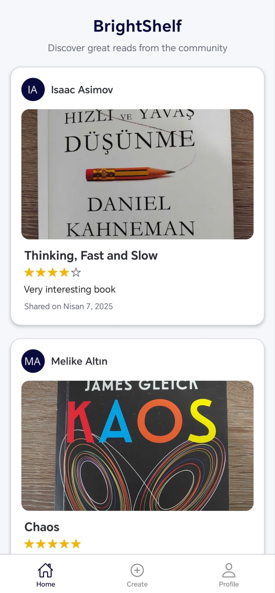
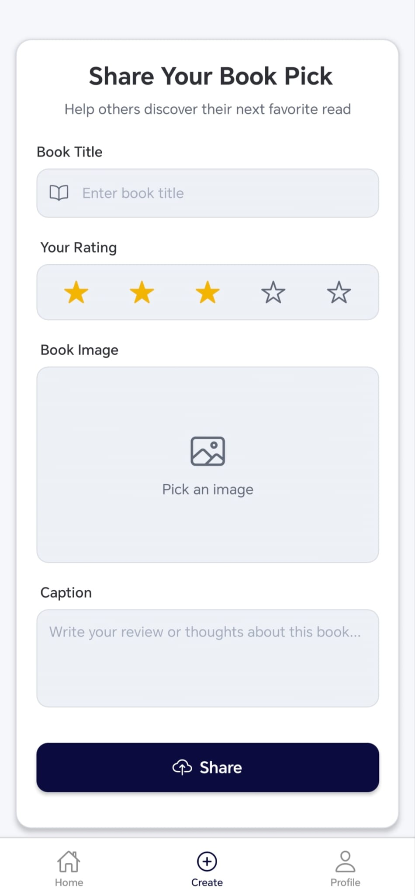

# BrightShelf

A social platform where book lovers can share their favorite reads, explore others’ recommendations, and discover new titles. Features a backend API and a smooth mobile app experience for browsing and sharing.

## Table of Contents

- [Screenshots](#screenshots)
- [Technology Stack](#technology-stack)

## Screenshots

  

    
<strong>Login</strong>

    
  

  

    
<strong>Signup</strong>

    
  

  

    
<strong>Home</strong>

    
  

  

    
<strong>Create</strong>

    
  

  

    
<strong>Profile</strong>

    
  

## Technology Stack

🛠️ **Built with:**

### Backend

- **Node.js | Express** – API server
- **MongoDB** – Database
- **Cloudinary** – Book cover storage
- **JWT** – Secure authentication

### Mobile

- **React Native** – Cross-platform app
- **Expo** – Development tools
- **Zustand** – State management
- **React Navigation** – Routing
